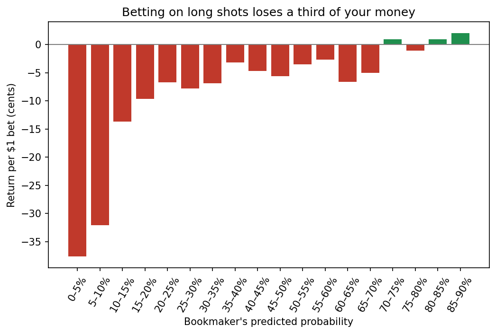
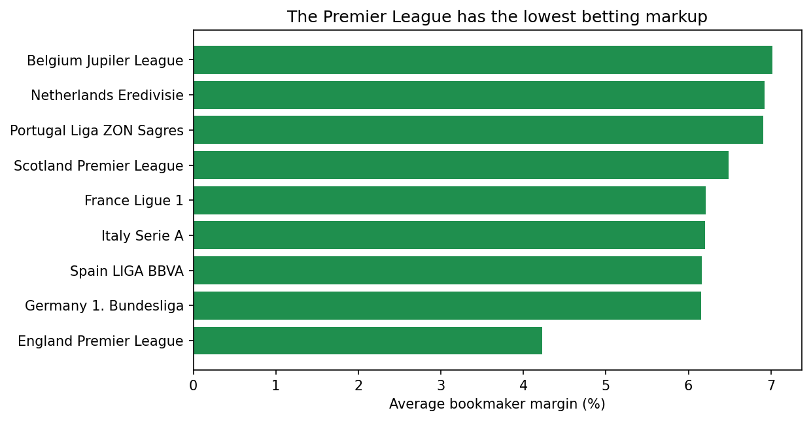

# Do Betting Odds Predict Soccer Results?

Bookmakers set odds for every match, and those odds imply a probability for each result. I used SQL and Python to test how accurate those probabilities are across 22,592 European league matches, where they're most wrong, and whether a bettor could profit from the mistakes.

## Key findings

- **The odds are well calibrated for most matches.** Between about 15% and 70%, the outcome happened within 1 to 2 points of what the odds implied. Across all matches, home wins (45.9% actual vs. 45.1% implied), draws (25.3% vs. 25.8%), and away wins (28.8% vs. 29.2%) were all close.
- **There's a clear favorite-longshot bias.** Teams given a 70% chance or better won 4 to 7 points more often than implied (for example, 77% actual vs. 72% implied). Big underdogs given 5 to 10% won only 5.7% of the time vs. 7.8% implied, about a quarter less often.
- **The bias isn't big enough to beat the bookmaker.** Betting $1 on long shots lost 32 to 38 cents on average, most bets lost about 5 cents, and heavy favorites roughly broke even. The bookmaker's margin, about 6% on average, cancels out the edge.
- **Margins vary by league.** The Premier League had the lowest average margin (4.2%), while Belgium, the Netherlands, and Portugal were around 7%. More betting volume and competition between bookmakers likely push prices down in the biggest league.

## Data

The [European Soccer Database](https://www.kaggle.com/datasets/hugomathien/soccer) from Kaggle: a SQLite database with about 26,000 matches from 11 European leagues, 2008 to 2016, including betting odds from several bookmakers. I used Bet365's odds, which were available for 22,592 matches in 9 leagues. Switzerland and Poland have no Bet365 odds in the data, so they're not included.

The database file is about 300 MB, which is too large for GitHub. To run the notebook, download `database.sqlite` from Kaggle and put it in a `data/` folder.

## Methods

1. **SQL:** joined the `Match`, `League`, and `Team` tables to build a match-level dataset with results and Bet365 home, draw, and away odds. Also calculated the average bookmaker margin by league directly in SQL.
2. **Odds to probabilities:** converted each decimal odd to an implied probability (1 / odds), then divided by the total to remove the bookmaker's margin, so the three probabilities for each match add up to 100%.
3. **Calibration:** grouped about 67,800 predictions (three per match) into 5-point probability buckets and compared the average predicted probability to how often the outcome actually happened.
4. **Betting returns:** calculated the average profit from a $1 bet on every outcome in each bucket.

## Tools

SQL (SQLite), Python (pandas, NumPy, matplotlib), Jupyter Notebook

## Files

| File | What it is |
|---|---|
| `analysis.ipynb` | Full analysis, SQL queries, and charts |
| `images/` | Charts used in this README |

## Limitations

The data covers 2008 to 2016 and one bookmaker, so current markets or other bookmakers could behave differently. The highest probability buckets have fewer matches (the 85 to 90% bucket has 152), so the size of the bias at the very top is less certain than in the middle. The betting returns are averages over many bets and don't account for picking strategies after seeing the results.

---

**David Barrero** · [Portfolio](https://david-barrero.github.io) · [LinkedIn](https://www.linkedin.com/in/david-barrero1) · [GitHub](https://github.com/david-barrero)
